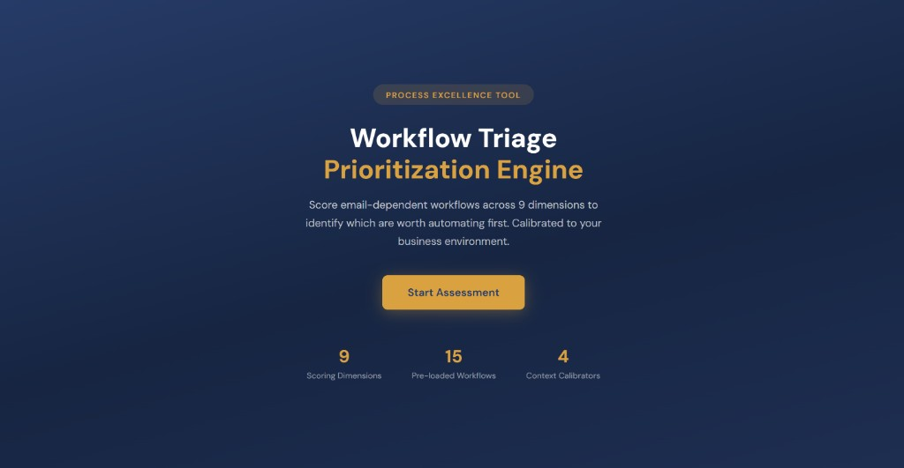
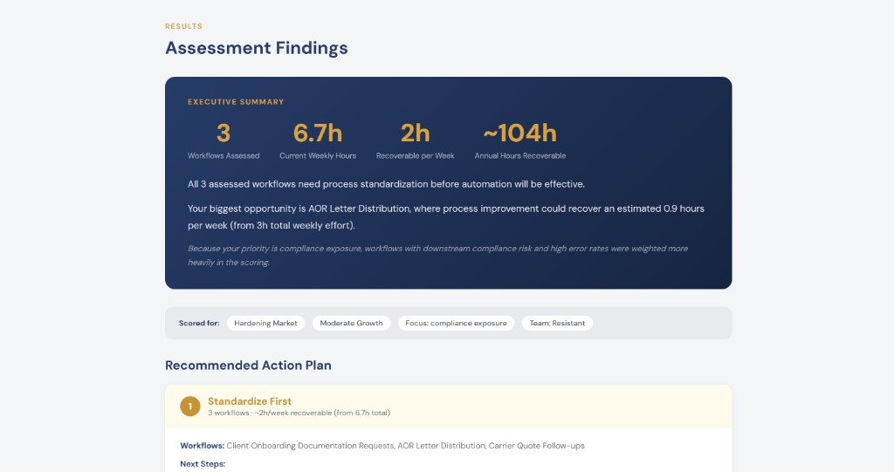
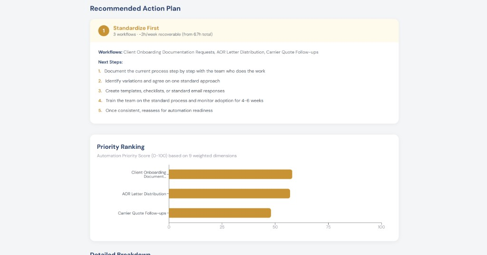
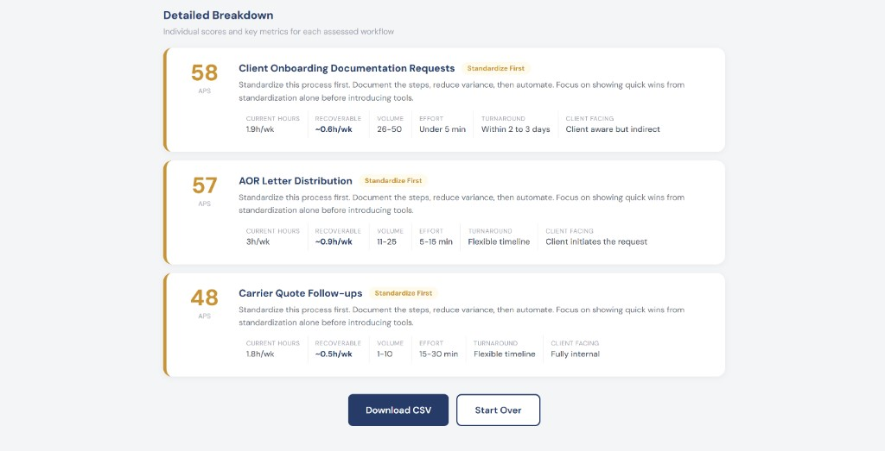

# TriageIQ — Workflow Automation Prioritizer

> **A process excellence tool for insurance operations teams.**  
> Stop guessing where to start with automation. Score your workflows, see what's worth it, and get a clear action plan.

---

## The Problem

Insurance brokerage operations teams deal with dozens of email-dependent workflows — policy renewals, certificate requests, claims coordination, carrier follow-ups. When leadership asks "what should we automate first?", the answer is usually a gut feeling.

TriageIQ replaces that gut feeling with a structured, data-driven assessment.

---

## How It Works

1. **Select your workflows** — choose from 15 pre-loaded insurance brokerage workflows
2. **Score each one** across 9 business dimensions (volume, manual effort, standardization, error risk, downstream impact, and more)
3. **Calibrate to your environment** — set context like market conditions, growth stage, compliance focus, and team readiness
4. **Get your results** — an Automation Priority Score (0–100) for each workflow, an executive summary, and a Recommended Action Plan

---

## Tool Overview

### Landing Page


---

## Results & Output

### Assessment Findings
An executive summary of your assessment — hours assessed, weekly effort, recoverable time, and a plain-English insight into your biggest opportunity.



---

### Recommended Action Plan
Workflows are grouped into clear action categories — **Automate Now**, **Standardize First**, or **Monitor** — with step-by-step next actions for each.



---

### Detailed Breakdown
Individual Automation Priority Scores for every workflow assessed, with key metrics: current hours per week, recoverable time, volume, effort, turnaround, and client-facing impact.



---

## Priority Score Guide

| Score | Recommendation | What it means |
|-------|---------------|---------------|
| 70–100 | **Automate Now** | Strong candidate — high volume, consistent process, clear ROI |
| 40–69 | **Standardize First** | Document and reduce variance before introducing automation tools |
| 0–39 | **Monitor** | Low ROI on automation currently — revisit later |

---

## Getting Started

```bash
npm install
npm run dev
```

Open [http://localhost:5173](http://localhost:5173) in your browser.

---

## Built By

Shubham Mittal · [LinkedIn](https://linkedin.com/in/shubham-mittal) · [Portfolio](https://shubham-mittal.com)
